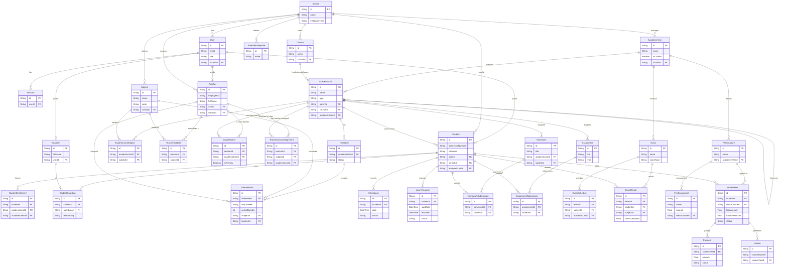

# Database Schema ER Diagram

This diagram represents the database structure defined in `prisma/schema.prisma`.

```mermaid
erDiagram
    %% ============================================
    %% CORE / AUTH
    %% ============================================
    School {
        String id PK
        String name
        String institutionType
    }
    User {
        String id PK
        String email
        String role
        String schoolId FK
    }
    Session {
        String id PK
        String userId FK
    }
    
    School ||--o{ User : "has"
    User ||--o{ Session : "has"
    User ||--o| Teacher : "profile"
    User ||--o| Student : "profile"
    User ||--o| Guardian : "profile"

    %% ============================================
    %% ACADEMIC STRUCTURE
    %% ============================================
    Course {
        String id PK
        String name
        String schoolId FK
    }
    AcademicYear {
        String id PK
        String name
        Boolean isCurrent
        String schoolId FK
    }
    AcademicUnit {
        String id PK
        String name
        String type
        String parentId FK
        String courseId FK
        String academicYearId FK
    }
    Subject {
        String id PK
        String name
        String code
        String schoolId FK
    }
    AcademicUnitSubject {
        String id PK
        String academicUnitId FK
        String subjectId FK
    }

    School ||--o{ Course : "offers"
    School ||--o{ AcademicYear : "manages"
    School ||--o{ Subject : "defines"
    AcademicYear ||--o{ AcademicUnit : "contains"
    Course ||--o{ AcademicUnit : "has batches/classes"
    AcademicUnit ||--o{ AcademicUnit : "hierarchy"
    AcademicUnit ||--o{ AcademicUnitSubject : "offers"
    Subject ||--o{ AcademicUnitSubject : "taught in"

    %% ============================================
    %% TEACHERS
    %% ============================================
    Teacher {
        String id PK
        String employeeId
        String fullName
        String userId FK
        String schoolId FK
    }
    TeacherSubject {
        String id PK
        String teacherId FK
        String subjectId FK
    }
    ClassTeacher {
        String id PK
        String teacherId FK
        String academicUnitId FK
        Boolean isPrimary
    }
    TeacherClassAssignment {
        String id PK
        String teacherId FK
        String subjectId FK
        String academicUnitId FK
    }

    School ||--o{ Teacher : "employs"
    Teacher ||--o{ TeacherSubject : "specializes in"
    Subject ||--o{ TeacherSubject : "taught by"
    Teacher ||--o{ ClassTeacher : "is class teacher"
    AcademicUnit ||--o{ ClassTeacher : "has class teacher"
    Teacher ||--o{ TeacherClassAssignment : "assigned to class"
    AcademicUnit ||--o{ TeacherClassAssignment : "has teacher assigned"

    %% ============================================
    %% STUDENTS
    %% ============================================
    Student {
        String id PK
        String admissionNumber
        String fullName
        String userId FK
        String schoolId FK
        String academicUnitId FK
    }
    StudentEnrollment {
        String id PK
        String studentId FK
        String academicUnitId FK
        String academicYearId FK
    }
    Guardian {
        String id PK
        String fullName
        String userId FK
    }
    StudentGuardian {
        String id PK
        String studentId FK
        String guardianId FK
        String relationship
    }

    School ||--o{ Student : "enrolls"
    AcademicUnit ||--o{ Student : "current class"
    Student ||--o{ StudentEnrollment : "history"
    Student ||--o{ StudentGuardian : "has"
    Guardian ||--o{ StudentGuardian : "of"

    %% ============================================
    %% TIMETABLE
    %% ============================================
    TimetableTemplate {
        String id PK
        String name
    }
    Timetable {
        String id PK
        String academicUnitId FK
        String status
    }
    TimetableSlot {
        String id PK
        String timetableId FK
        String dayOfWeek
        Int periodNumber
        String subjectId FK
        String teacherId FK
    }

    School ||--o{ TimetableTemplate : "defines"
    AcademicUnit ||--o{ Timetable : "has"
    Timetable ||--o{ TimetableSlot : "contains"
    Subject ||--o{ TimetableSlot : "scheduled"
    Teacher ||--o{ TimetableSlot : "assigned"

    %% ============================================
    %% ATTENDANCE
    %% ============================================
    Attendance {
        String id PK
        String studentId FK
        DateTime date
        String status
    }
    LeaveRequest {
        String id PK
        String studentId FK
        DateTime startDate
        DateTime endDate
        String status
    }

    Student ||--o{ Attendance : "records"
    Student ||--o{ LeaveRequest : "requests"

    %% ============================================
    %% HOMEWORK & ASSIGNMENTS
    %% ============================================
    Homework {
        String id PK
        String title
        String academicUnitId FK
        String subjectId FK
    }
    HomeworkSubmission {
        String id PK
        String homeworkId FK
        String studentId FK
    }
    Assignment {
        String id PK
        String title
        String type
    }
    AssignmentSubmission {
        String id PK
        String assignmentId FK
        String studentId FK
    }

    AcademicUnit ||--o{ Homework : "assigned"
    Homework ||--o{ HomeworkSubmission : "submissions"
    Student ||--o{ HomeworkSubmission : "submits"
    AcademicUnit ||--o{ Assignment : "assigned"
    Assignment ||--o{ AssignmentSubmission : "submissions"
    Student ||--o{ AssignmentSubmission : "submits"

    %% ============================================
    %% EXAMS
    %% ============================================
    Exam {
        String id PK
        String name
        String examType
    }
    ExamSchedule {
        String id PK
        String examId FK
        String subjectId FK
        String academicUnitId FK
    }
    ExamResult {
        String id PK
        String examId FK
        String studentId FK
        String subjectId FK
        Float marksObtained
    }

    AcademicYear ||--o{ Exam : "conducts"
    Exam ||--o{ ExamSchedule : "schedule"
    Exam ||--o{ ExamResult : "results"
    Student ||--o{ ExamResult : "receives"

    %% ============================================
    %% FINANCE
    %% ============================================
    FeeStructure {
        String id PK
        String name
        String academicYearId FK
    }
    FeeComponent {
        String id PK
        String name
        Float amount
        String feeStructureId FK
    }
    StudentFee {
        String id PK
        String studentId FK
        String feeStructureId FK
        Float totalAmount
        Float balanceAmount
        String status
    }
    Payment {
        String id PK
        String studentFeeId FK
        Float amount
        String status
    }
    Invoice {
        String id PK
        String invoiceNumber
        String studentFeeId FK
    }

    AcademicYear ||--o{ FeeStructure : "defines"
    FeeStructure ||--o{ FeeComponent : "composed of"
    FeeStructure ||--o{ StudentFee : "applied to"
    Student ||--o{ StudentFee : "billed"
    StudentFee ||--o{ Payment : "paid by"
    StudentFee ||--o{ Invoice : "generates"

```
